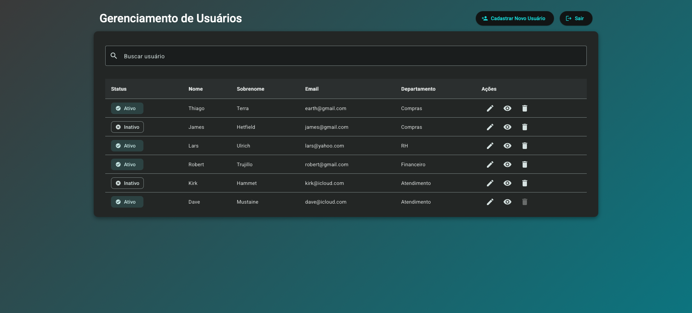
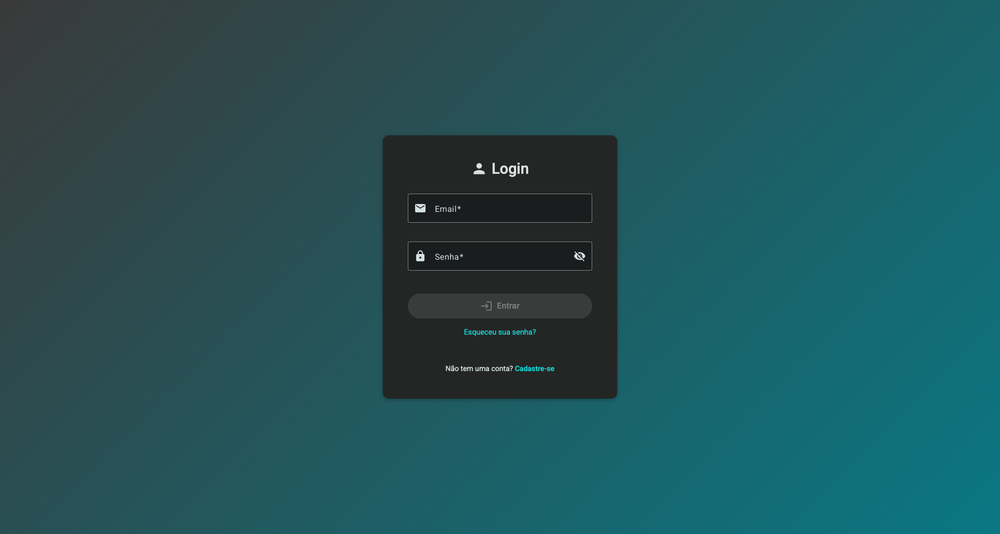
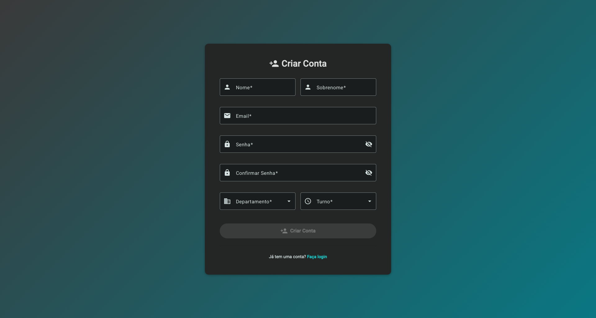
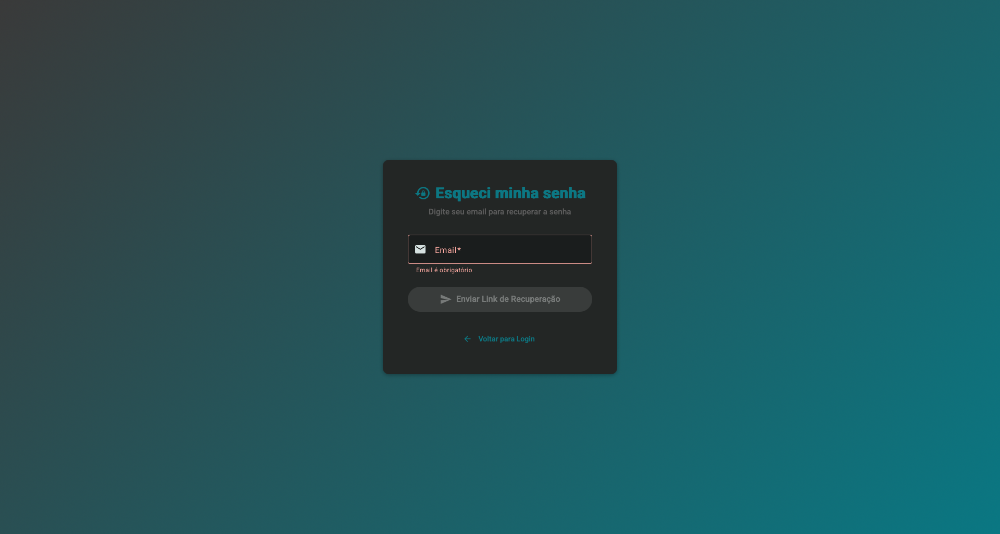
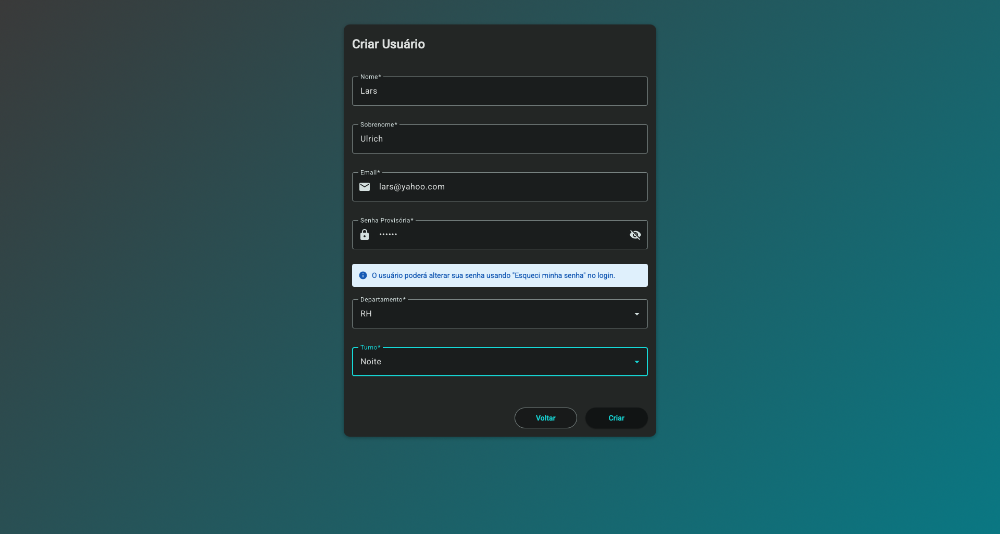
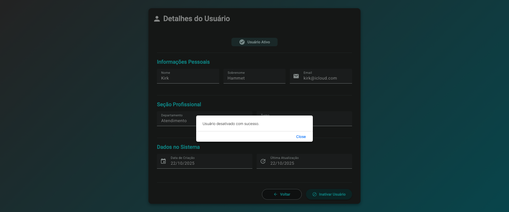
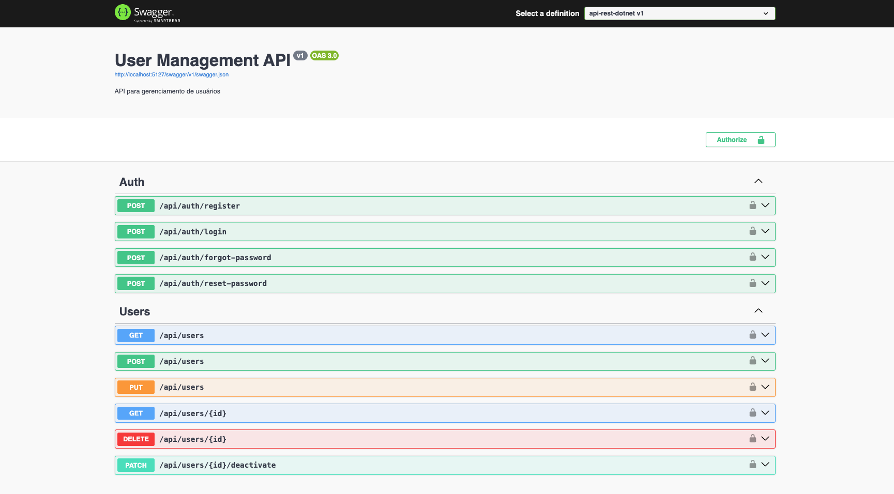

# Sistema de Gerenciamento de Usuários

Aplicação Full Stack com: autenticação JWT, operações CRUD, Backend em ASP.NET Core 9.0 e Frontend Angular.

## 🚀 Tech Stack

**Backend:** .NET 9.0, ASP.NET Core Web API, Entity Framework Core, Azure SQL Edge*, JWT Authentication  
**Frontend:** Angular, TypeScript, Angular Material Design, Node.js 20.19 LTS

**SQL Server engine e compatível com o Entity Framework*

## 📋 Principais Funcionalidades

- ✅ **CRUD completo** de usuários
- ✅ **Autenticação JWT**
- ✅ **Categorização** por departamento e turno
- ✅ **Desativação** de usuários
- ✅ **Recuperação de senha** via email
- ✅ **Validação** de formulários
- ✅ **Interface moderna** com gradientes

## ✨ Execução Rápida

### 📋 Pré-requisitos
Certifique-se de ter instalado:
- **Docker** (para executar o banco de dados)
- **.NET 9.0 SDK** 
- **Node.js 20.19 LTS**

### 📥 Clonar Repositório
```bash
git clone <URL_DO_REPOSITORIO>
cd desafio-usuarios-thiago-terra
```

### 1. Backend
```bash
# 1. Iniciar Azure SQL Edge (Docker deve estar rodando)
docker run -e ACCEPT_EULA=1 -e MSSQL_SA_PASSWORD=SuaSenha123! -p 1433:1433 --name sqlserver -d mcr.microsoft.com/azure-sql-edge

# 2. Verificar se container está ativo
docker ps

# 3. Configurar ambiente
cd api-rest-dotnet && cp appsettings.Development.json.example appsettings.Development.json

# 4. Instalar Dependências
dotnet restore
# Instalar Entity Framework Tools globalmente (necessário para comandos 'dotnet ef')
dotnet tool install --global dotnet-ef

# 5. Executar migrações e iniciar
dotnet ef database update && dotnet run
```

### 2. Frontend
```bash
# 1. Abrir um novo terminal e navegar para pasta do frontend
cd front-angular

# 2. Usar versão correta do Node.js (se nvm estiver instalado)
nvm use  # Instala/usa Node.js 20.19 automaticamente (observa arquivo .nvmrc)
# Se nvm não estiver instalado, certifique-se de ter Node.js 20.19+ instalado

# 3. Instalar dependências
npm install

# 4. Iniciar servidor
npm start
```

### 3. Acessar
- **Frontend:** http://localhost:4200
- **API Docs:** http://localhost:5127/swagger

**🎉 Faça seu cadastro e comece a usar a aplicação!**

## 🧪 Testes Unitários

### Frontend (Angular)
```bash
# 1. Abrir um novo terminal e navegar para pasta do frontend
cd front-angular

# 2. Usar versão correta do Node.js (se nvm estiver instalado)
nvm use  # Instala/usa Node.js 20.19 automaticamente (observa arquivo .nvmrc)
# Se nvm não estiver instalado, certifique-se de ter Node.js 20.19+ instalado

# 3. Executar testes
npm run test
```
- **Cobertura:** AuthService
- **Frameworks:** Jasmine + Karma
- **Resultado:** Uma nova aba/janela do navegador será aberta com Karma - Jasmine exibindo os resultados dos testes

### Backend (.NET)
```bash
# 1. Abrir um novo terminal e navegar para pasta de testes
cd api-rest-dotnet.Tests

# 2. Executar testes
dotnet test
```
- **Cobertura:** PasswordService, TokenService
- **Frameworks:** xUnit + Moq

## 🖼️ Screenshots

### Interface Principal

*Dashboard com lista de usuários, filtros e ações CRUD (com proteção contra auto-exclusão)*

### Autenticação

*Tela de login com validação de formulário*


*Tela de cadastro com validações e seleção de departamento/turno*


*Fluxo de recuperação de senha via token*

### CRUD de Usuários

*Formulário de cadastro/edição com validações em tempo real*


*Visualização detalhada do usuário com opção para desativá-lo*

### API Documentation

*Documentação interativa da API com endpoints de autenticação e usuários*

## 🔐 Autenticação e Autorização

### Sistema de Login
- **JWT Tokens** com expiração configurável
- **BCrypt** para hash de senhas com salt automático
- **Recuperação de senha** via token temporário (expira em 1 hora)

### Endpoints de Autenticação
| Método | Endpoint | Descrição |
|--------|----------|-----------|
| `POST` | `/api/auth/register` | Registro de novo usuário |
| `POST` | `/api/auth/login` | Login com email/senha |
| `POST` | `/api/auth/forgot-password` | Solicitar reset de senha |
| `POST` | `/api/auth/reset-password` | Resetar senha com token |

### 🔧 Reset de Senha - Console Output
**Importante:** Durante o desenvolvimento, os dados de reset de senha são exibidos no console do backend:

#### Ao solicitar reset (`/api/auth/forgot-password`):
```
========================================
📧 RESET PASSWORD LINK (Console Output)
========================================
User: usuario@email.com
Link: http://localhost:4200/reset-password?token=abc123...
Token expira em: 08/01/2025 15:30:00 UTC
========================================
```

#### Ao confirmar reset (`/api/auth/reset-password`):
```
========================================
✅ PASSWORD RESET SUCCESSFUL
========================================
User: usuario@email.com
Reset at: 08/01/2025 14:45:00 UTC
========================================
```

### Proteção de Rotas
- **AuthGuard** no frontend protege rotas autenticadas
- **Token automático** nas requisições via interceptor
- **Logout** limpa tokens e redireciona para a tela de Login

## 🔌 API Endpoints

### Usuários (Requer Autenticação)
| Método | Endpoint | Descrição |
|--------|----------|-----------|
| `GET` | `/api/users` | Lista usuários |
| `GET` | `/api/users/{id}` | Busca por ID |
| `POST` | `/api/users` | Cria usuário |
| `PUT` | `/api/users` | Atualiza usuário |
| `PATCH` | `/api/users/{id}/deactivate` | Desativa usuário |
| `DELETE` | `/api/users/{id}` | Remove usuário |

## 📊 Modelo de Dados (Tabela Users)

```typescript
UserModel {
  Id: number
  Name: string
  LastName: string
  Email: string (único)
  PasswordHash: string (hash BCrypt)
  PasswordSalt: string (gerenciado pelo BCrypt)
  ResetPasswordToken: string (opcional)
  ResetPasswordTokenExpires: DateTime (opcional)
  TokenCreatedAt: DateTime
  Department: enum (RH, Financeiro, Compras, Atendimento, Zeladoria)
  Shift: enum (Manhã, Tarde, Noite)
  Active: boolean
  CreatedAt: DateTime
  UpdatedAt: DateTime
}
```

## 🌐 Testes Crossbrowser

Aplicação testada e validada nos seguintes navegadores:
- ✅ Google Chrome 141+
- ✅ Safari 26.0.1

**Funcionalidades testadas:** Login, CRUD, Navegação, Logout

## ⚙️ Configuração Detalhada

### Backend - appsettings.Development.json
```json
{
  "ConnectionStrings": {
    "DefaultConnection": "Data Source=localhost,1433;Initial Catalog=User;User Id=sa;Password=SuaSenha123!;Encrypt=false;TrustServerCertificate=true"
  },
  "AppSettings": {
    "Token": "GENERATE_YOUR_OWN_SECRET_KEY_AT_LEAST_64_CHARACTERS_LONG_FOR_HMAC_SHA512"
  }
}
```

### Frontend - environment.development.ts
```typescript
export const environment = {
  ApiUrl: 'http://localhost:5127/api',
};
```

## 🔧 Comandos Úteis

```bash
# Migrações
dotnet ef migrations add NomeMigracao
dotnet ef database update

# Build
dotnet build
npm run build

# Testes
dotnet test
npm run test
```

## 👨‍💻 Autor

**Thiago Terra**  
LinkedIn: [Thiago Terra](https://www.linkedin.com/in/thiago-terra-158a71266/)  
GitHub: [@ThiagoTerraDev](https://github.com/ThiagoTerraDev)
